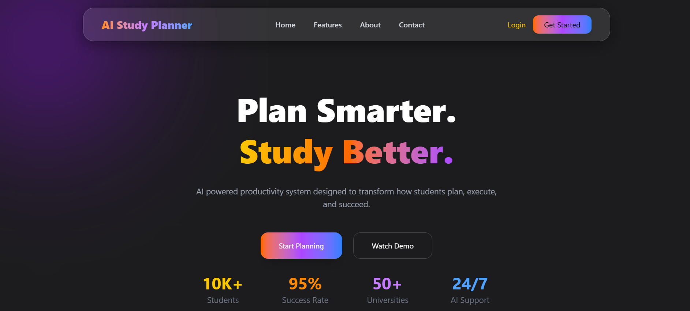
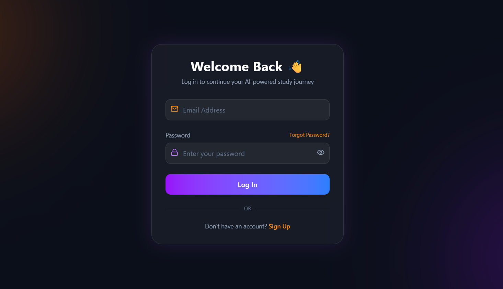
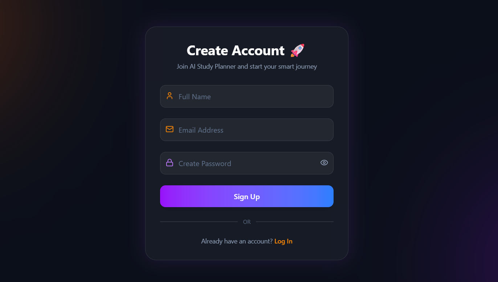

# 🚀 AI Study Planner + Productivity Tracker

A **Smart AI-powered study planning system** built with the **MERN Stack (MongoDB, Express, React, Node.js)** that helps students create **realistic and adaptive study schedules** instead of rigid timetables.

Unlike traditional planners, this system analyzes **study behavior, productivity, and completion rates** to dynamically adjust study plans and reduce burnout.

---

## 🎯 Problem

Many students struggle with:

- Unrealistic study schedules
- Lack of consistency
- Overplanning or no planning
- Burnout during exam preparation

Traditional timetable apps create **static plans** that fail when students miss tasks.

---

## 💡 Solution

**AI Study Planner** solves this by generating **adaptive and personalized study schedules** based on:

- Exam deadline
- Subjects and difficulty level
- Daily available study hours
- User productivity patterns

Instead of fixed timetables, the system **dynamically adjusts the study plan** based on user progress and behavior.

---

# 🧠 Core Features

### 🤖 AI Personalized Study Planner

Creates a customized daily study schedule using exam date, subjects, skill level, and available hours.

### 🔄 Adaptive Rescheduling

Automatically adjusts the schedule when tasks are skipped or partially completed.

### 😵 Burnout Detection

Tracks study patterns and suggests lighter schedules or recovery days when burnout risk increases.

### 🍅 Pomodoro AI Focus Coach

Monitors focus sessions and suggests optimal study and break durations.

### 📈 Focus Score Prediction

Generates a daily **Focus Score (0–100)** based on productivity, task completion, and study consistency.

# 🏗 Tech Stack

## 🎨 Frontend

---

## ⚙️ Backend

---

## 🗄 Database

---

## 🤖 AI System

**Architecture:**  
Hybrid AI System

- Rule-based scheduling engine
- LLM-powered suggestions

---

# 📸 Application Screenshots

## 🏠 Home Page

Shows the landing page introducing the AI Study Planner, key features, and call-to-action.

---

## 🔐 Authentication

Secure authentication system for user account access and registration.

---

### 🔑 Login Page

Allows existing users to securely log into the platform.

---

### 📝 Sign Up Page

New users can create an account to start planning their study schedule.

<!--
## 📊 Dashboard Overview

Displays:

- Today's study plan
- Focus score
- Progress statistics
- AI motivational suggestions

---

## 🎯 Goals Setup

Users can create exams, add subjects, and define study topics.

---

## 📅 Study Planner (Calendar View)

AI-generated study schedule with task completion tracking and rescheduling.

---

## 🍅 Pomodoro Focus Room

Smart focus timer that tracks productivity sessions and break suggestions.

---

## 📈 Analytics Dashboard

Visual charts showing:

- Study consistency
- Focus trends
- Subject strength
- Burnout indicators

---

## 🧠 AI Insights & Suggestions

AI-generated insights based on user productivity and study behavior.

 -->

---

# 🤝 Contributors & Collaboration

This project is built through collaborative efforts.  
Below are the team members who contributed to the development of the **AI Study Planner + Productivity Tracker**.

---

## 👥 Project Contributors

| Name            | Role                             | GitHub Profile                                   |
| --------------- | -------------------------------- | ------------------------------------------------ |
| Harsh Pandey    | Frontend Development             | [GitHub](https://github.com/Harsh28Pandey)       |
| Ayansh Yadav    | Backend Development              | [GitHub](https://github.com/Ayansh252yadav)      |
| Anmol Yadav     | AI Logic & Scheduling Algorithm  | [GitHub](https://github.com/Anmoly6422)          |
| Abhay Singh     | Analytics & Performance Tracking | [GitHub](https://github.com/Abhay2110s)          |
| Anshuman Sharma | Testing & Documentation          | [GitHub](https://github.com/Anshuman-sharma2006) |

---
